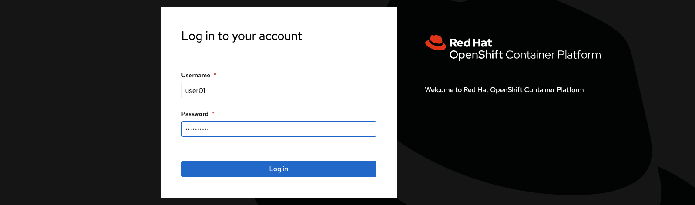

# ROSA HCP LDAP Proxy Demo

Container files and configurations for ROSA HCP with LDAP proxy. ***Please note that this is for demo purposes only and should never be used in production as-is.***

### Problem definition and solution

When using ROSA with Hosted Control Plane, in combination with an LDAP IDM, the requests will originate from the Red Hat-owned networks, rather than the VPC of the cluster's owner. This may be problematic for environments with strict security policies. 

This demo shows that the LDAP requests can easily be bounced via one or more of the worker nodes in the cluster's owner's VPC. These do not have to be special nodes, but could potentially be deployed on nodes designated to other infrastructure functionalities.

The demo consists of 3 parts:

* The OpenLDAP server containing some demo users
* The ldaptor-based LDAP Proxy
* The IDM configuration

### Setitng up the environment

* Bring up a ROSA HCP cluster, you can use the [AWS ROSA with hosted control planes cluster (ROSA HCP) fast deploy](https://github.com/CSA-RH/rosa-hcp-fast-deploy) repo to bring one up with a nice menu-driven setup.
* Create a new project with `oc new-project openldap`
* Bring up the OpenLDAP service with `oc apply -f openldap-server/openldap.yaml`
* Bring up the ldaptor proxy with `oc apply -f ldaptor/ldaptor-proxy.yaml`

Please note that the ldaptor proxy will only bring up one instance, if you want more, feel free to adjust the number of replicas. The OpenLDAP server is not configured for High Availability, that is beyond the scope of this demo.

### Testing the OpenLDAP server and ldaptor proxy

Included in this repo is a Deployment for the swissarmy container, which has many tools, including the openldap client utilities. You can deploy this container using `oc apply -f swissarmy/swissarmy.yaml`

Start a shell in the swissarmy container and launch a test query with the `ldapsearch` command directly to the OpenLDAP server

```
❯ oc exec --tty --stdin deployment/swissarmy-deployment -- /bin/bash
swissarmy-deployment-677dd6b8cb-7kvpb:/$ ldapsearch -x -H ldap://openldap-server-service.openldap:1389 -b "dc=example,dc=org"  "(sn=Bar2)"
# extended LDIF
...
# user02, users, example.org
dn: cn=user02,ou=users,dc=example,dc=org
cn: User2
cn: user02
sn: Bar2
...
# numResponses: 2
# numEntries: 1
```shell

Now, launch an LDAP query via the ldaptor proxy with the following command:

```shell
swissarmy-deployment-677dd6b8cb-7kvpb:/$ ldapsearch -x -H ldap://ldaptor-proxy-service.openldap:1389 -b "dc=example,dc=org"  "(sn=Bar2)"
# extended LDIF
...
# user02, users, example.org
dn: cn=user02,ou=users,dc=example,dc=org
cn: User2
cn: user02
sn: Bar2
...
# numResponses: 2
# numEntries: 1
```

If all is running well, the responses should be identical. If not, check the logs of the ldaptor proxy and OpenLDAP proxy for errors.

### Configuring the Identity Provider

Navigate to the [Red Hat Hybrid Cloud Console](https://console.redhat.com/openshift/). Select your cluster and click on the *Access Control" tab* There you will find a list of currently configured identity providers. Click the *Add identity provider* button and select LDAP.


Next, fill in the server URL, this also includes the base DN and any other special parameters you'd like to add.

Before clicking on the *Add* button, open the *Advanced settings* and make sure the *Insecure* option is selected.

Click the *Add* button at the bottom of the form and give it a few minutes for the changes to pushed to the cluster and for the oauth containers to be recreated with the new configuration.

### Logging in with LDAP

Open the web console of your cluster in an incognito window, and select the *LDAP* provider

Fill in the username and password (user01/password01)

If all is configured properly, you should be greeted with the developer aspect of the cluster's web console.


### Debugging the server and proxy

You can view the log of the ldaptor proxy service with 
```shell
❯ oc logs -f deployment/ldaptor-proxy 
2024-07-25T09:23:18+0000 [-] Loading /proxy/main.py...
2024-07-25T09:23:18+0000 [-] Loaded.
2024-07-25T09:23:18+0000 [twisted.scripts._twistd_unix.UnixAppLogger#info] twistd 24.3.0 (/usr/local/bin/python 3.12.4) starting up.
2024-07-25T09:23:18+0000 [twisted.scripts._twistd_unix.UnixAppLogger#info] reactor class: twisted.internet.epollreactor.EPollReactor
2024-07-25T09:23:18+0000 [-] ServerFactory starting on 1389
2024-07-25T14:45:51+0000 [twisted.internet.endpoints.OneShotFactory#info] Starting factory <twisted.internet.endpoints.connectProtocol.<locals>.OneShotFactory object at 0x7f0f462722d0>
2024-07-25T14:45:51+0000 [LDAPClient,client] Request => LDAPSearchRequest(baseObject=b'dc=example,dc=org', scope=2, derefAliases=0, sizeLimit=2, timeLimit=0, typesOnly=0, filter=LDAPFilter_and(value=[LDAPFilter_present(value=b'objectClass'), LDAPFilter_equalityMatch(attributeDesc=BEROctetString(value=b'uid'), assertionValue=BEROctetString(value=b'user01'))]), attributes=[b'cn', b'dn', b'uid'])
2024-07-25T14:45:51+0000 [LDAPClient,client] Response => LDAPSearchResultEntry(objectName=b'cn=user01,ou=users,dc=example,dc=org', attributes=[(b'cn', [b'User1', b'user01']), (b'uid', [b'user01'])])
2024-07-25T14:45:51+0000 [LDAPClient,client] Request => LDAPSearchRequest(baseObject=b'dc=example,dc=org', scope=2, derefAliases=0, sizeLimit=2, timeLimit=0, typesOnly=0, filter=LDAPFilter_and(value=[LDAPFilter_present(value=b'objectClass'), LDAPFilter_equalityMatch(attributeDesc=BEROctetString(value=b'uid'), assertionValue=BEROctetString(value=b'user01'))]), attributes=[b'cn', b'dn', b'uid'])
2024-07-25T14:45:51+0000 [LDAPClient,client] Response => LDAPSearchResultDone(resultCode=0)
2024-07-25T14:45:51+0000 [LDAPClient,client] Request => LDAPBindRequest(version=3, dn=b'cn=user01,ou=users,dc=example,dc=org', auth=****, sasl=False)
2024-07-25T14:45:51+0000 [LDAPClient,client] Response => LDAPBindResponse(resultCode=0)
2024-07-25T14:45:51+0000 [twisted.internet.endpoints.OneShotFactory#info] Stopping factory <twisted.internet.endpoints.connectProtocol.<locals>.OneShotFactory object at 0x7f0f462722d0>
```
To view the OpenLDAP log, you can do the following:
```shell
❯ oc logs -f deployment/openldap-server
 09:19:58.17 INFO  ==> ** Starting LDAP setup **
 09:19:58.20 INFO  ==> Validating settings in LDAP_* env vars
 09:19:58.21 INFO  ==> Initializing OpenLDAP...
 09:19:58.22 INFO  ==> Creating LDAP online configuration
 09:19:58.22 INFO  ==> Creating slapd.ldif
 09:19:58.24 INFO  ==> Starting OpenLDAP server in background
 09:19:59.24 INFO  ==> Configure LDAP credentials for admin user
 09:19:59.25 INFO  ==> Adding LDAP extra schemas
 09:19:59.27 INFO  ==> Creating LDAP default tree
 09:20:00.31 INFO  ==> ** LDAP setup finished! **

 09:20:00.34 INFO  ==> ** Starting slapd **
66a218c0.1528e731 0x7fef17ccb740 @(#) $OpenLDAP: slapd 2.6.8 (Jul 22 2024 15:17:33) $
        @5166997a1da7:/bitnami/blacksmith-sandox/openldap-2.6.8/servers/slapd
66a218c0.15add039 0x7fef17ccb740 slapd starting
66a2651f.0f79490c 0x7feed65fd6c0 conn=1014 fd=12 ACCEPT from IP=10.128.0.51:42866 (IP=0.0.0.0:1389)
66a2651f.0f7b4b03 0x7feed65fd6c0 conn=1014 op=0 SRCH base="dc=example,dc=org" scope=2 deref=0 filter="(&(objectClass=*)(uid=user01))"
66a2651f.0f7bb917 0x7feed65fd6c0 conn=1014 op=0 SRCH attr=cn dn uid
66a2651f.0f842d9a 0x7feed65fd6c0 conn=1014 op=0 SEARCH RESULT tag=101 err=0 qtime=0.000011 etime=0.000624 nentries=1 text=
66a2651f.0fc0d0ec 0x7feed6dfe6c0 conn=1014 op=1 BIND dn="cn=user01,ou=users,dc=example,dc=org" method=128
66a2651f.0fc1b012 0x7feed6dfe6c0 conn=1014 op=1 BIND dn="cn=user01,ou=users,dc=example,dc=org" mech=SIMPLE bind_ssf=0 ssf=0
66a2651f.0fc287be 0x7feed6dfe6c0 conn=1014 op=1 RESULT tag=97 err=0 qtime=0.000012 etime=0.000143 text=
66a2651f.0ff2290c 0x7feed65fd6c0 conn=1014 op=2 UNBIND
66a2651f.0ff370d7 0x7feed65fd6c0 conn=1014 fd=12 closed
```
